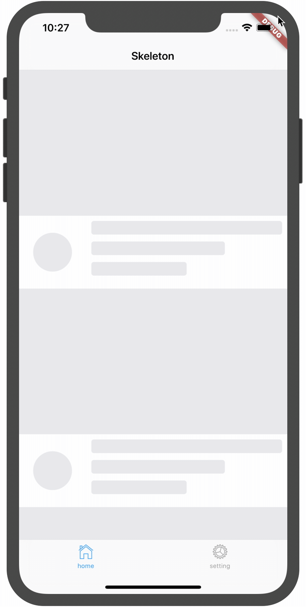

# skeleton

a widget for build beauty skeleton screen



## Usage

[example/lib/main.dart](example/lib/main.dart)

```dart
final controller = SkeletonController();

Container(child: Skeleton(controller));

```
